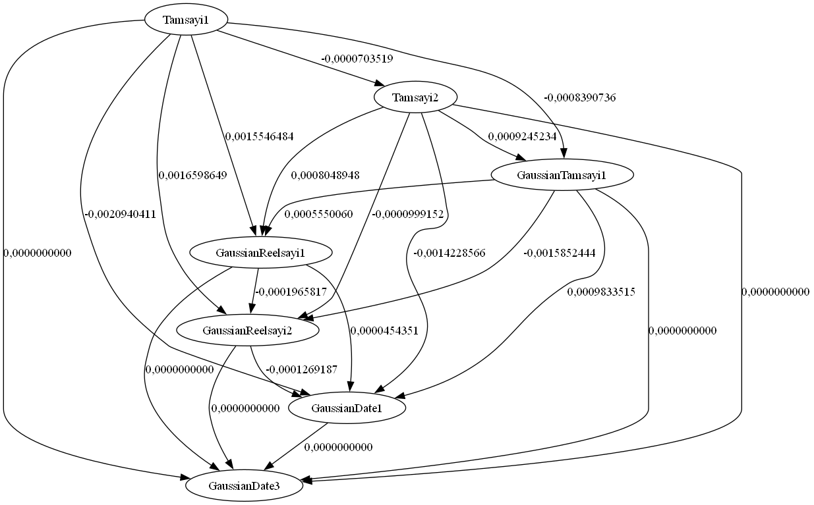

# 🌸 Java Data Similarity and Generation

Bu depo, veritabanı işlemleri ve metin benzerliği analizine yönelik **üç bağımsız Java projesinden** oluşur:  
🍃 Veri üretimi  
🍃 Sistem kayıtlarının saklanması  
🍃 Metinsel benzerlik analizi ve görselleştirme
---

## 📁 Proje Yapısı

```bash
java-data-similarity-and-generation/
├── DB_datageneration/
│   ├── basic_data.db                  # Üretilen veritabanı
│   ├── BinaryColumnSimilarity.dot     # Graphviz DOT çıktısı
│   ├── BinaryColumnSimilarity.png     # Sütun benzerliği grafiği (PNG)
│   └── src/
│       └── (default package)/
│           ├── AllColumns.java
│           ├── ColumnSimilarity.java
│           ├── data_Graphviz.java     # BinaryColumnSimilarity tablosunu görselleştirir
│           ├── InsertMillionRows.java
│           ├── Main.java
│           └── Pearson.java
│
├── registry/
│   ├── registry.db                    # Kayıt veritabanı (ignore edildi)
│   └── src/
│       └── registry/
│           └── Main.java
│
├── text/
│   ├── dictionary.db                  # Kelime veritabanı
│   ├── similarities.dot               # DOT formatında grafik çıktısı
│   ├── Similarities-graph.png         # Graphviz görselleştirme sonucu
│   ├── zemberek-ambiguous-words.txt   # Benzer kelime listesi
│   └── src/
│       └── text/
│           ├── DBWordReader.java
│           ├── main.java
│           ├── Run.java
│           ├── SimilarityCalculator.java
│           ├── SimilaritySaver.java
│           └── text_Graphviz.java
│
├── .gitignore
├── LICENSE
└── README.md

```

## 🌱 1️⃣ DB_datageneration Projesi

### 🎯 Amacı  
Gerçek verinin kullanılamadığı durumlarda (gizlilik, test, analiz vb.) yapay veri üretimi sağlar. Bu veriler üzerinden kolonlar arası benzerlik analizleri yapılabilir. Ayrıca benzerlik sonuçları görsel olarak Graphviz ile temsil edilebilir.

### ✨ Özellikler  
- 🔢 Rastgele sayısal ve metinsel veri üretimi  
- 🗃️ Üretilen verilerin `basic_data.db` adlı SQLite veritabanına kaydedilmesi  
- ⚙️ Satır ve kolon sayılarının dinamik olarak belirlenebilmesi  
- 📈 Pearson korelasyonu ile:
  - Tek kolonun geçmiş (lag-1) değerleriyle olan benzerliği (`ColumnSimilarity`)
  - İki farklı kolon arasındaki benzerlik oranları (`BinaryColumnSimilarity`)
  - Her kolonun tüm diğer kolonlarla ortalama benzerlik skoru (`AverageOfAll`)
- 🖼️ `BinaryColumnSimilarity` tablosundaki sonuçlar görselleştirilir:
  - DOT formatında grafik dosyası oluşturulur (`BinaryColumnSimilarity.dot`)
  - Graphviz `dot` komutu kullanılarak PNG çıktısı alınır (`BinaryColumnSimilarity.png`)
  - Bu işlem `data_Graphviz.java` sınıfı tarafından gerçekleştirilir

### 📌 Örnek Görselleştirme  
Aşağıda `BinaryColumnSimilarity` tablosuna ait benzerlik grafiği yer almaktadır:



### 🧩 Önemli Java Sınıfları  
| Sınıf | Açıklama |
|-------|----------|
| `InsertMillionRows.java` | Gaussian dağılım ile rastgele veri üretir |
| `ColumnSimilarity.java` | Kolonların kendi geçmiş değerleriyle olan korelasyonunu hesaplar |
| `AllColumns.java` | Bütün kolonlar arasında ortalama benzerliği hesaplar |
| `Pearson.java` | Pearson korelasyon hesaplaması içerir |
| `data_Graphviz.java` | Binary kolon benzerliklerini DOT/PNG formatında görselleştirir |

## 🔧 Kullanılan Teknolojiler ve Kütüphaneler

Bu proje, Java diliyle geliştirilmiş olup, veritabanı işlemleri, grafik görselleştirme ve yapay veri üretimi gibi görevler için aşağıdaki kütüphane ve araçları kullanır:

### ☕ Java Sürümü
- Java SE 17 veya Java SE 21 ile uyumludur.

### 🗄️ Veritabanı
- **SQLite JDBC Driver**  
  `org.xerial:sqlite-jdbc:3.36.0.3`  
  Java üzerinden `.db` dosyası ile çalışmak için kullanılır.

### 📊 Grafik Görselleştirme
- **Graphviz (sistem genelinde kurulu olmalı)**  
  `dot` komutu ile `.dot` dosyalarından `.png` çıktısı oluşturmak için.
- **graphviz-java**  
  `guru.nidi:graphviz-java:0.18.1`  
  Java üzerinden grafik/dot dosyası üretimi için kullanılır.

### 📦 Ek Bağımlılıklar
- **Apache Commons Exec**  
  `commons-exec:1.3`  
  Dış komutların (örn. `dot`) Java'dan çalıştırılabilmesi için.
- **SLF4J (Logging)**
  - `slf4j-api:1.7.36`
  - `slf4j-simple:1.7.36`  
  Loglama altyapısı için kullanılır.

### 📚 Yapay Veri Üretimi
- Gaussian (normal dağılım) kullanılarak sayısal veri üretimi yapılır.
- Bu sayede, istatistiksel olarak anlamlı ve kontrollü test verileri oluşturulur.

### 🖥️ Geliştirme Ortamı
- IntelliJ IDEA, Eclipse veya başka bir Java destekli IDE ile uyumludur.


---
## 🗂️ 2️⃣ Registry Projesi

### 🎯 Amacı  
Windows kayıt defteri üzerinden sistem bilgilerini okur ve bu verileri SQLite veritabanına kaydeder. Aynı zamanda temel CRUD işlemleri için kullanılabilir.

### ✨ Özellikler  
- 🪟 Windows Registry'den veri okuma (`Advapi32Util.registryGetValues`)  
- 📥 Verilerin `registry.db` dosyasına kaydedilmesi  
- ⌨️ Konsol tabanlı çalışma (GUI içermez)  
- 🔁 Veri güncelleme, silme ve ekleme (CRUD)

## 🔧 Kullanılan Teknolojiler ve Kütüphaneler

Bu modül, Windows işletim sisteminde kayıt defteri (registry) erişimi sağlar ve kayıt verilerini SQLite veritabanına kaydeder. Aşağıdaki teknolojiler ve kütüphaneler kullanılmıştır:

### ☕ Java Sürümü
- Java SE 17 veya üzeri (JDK 17+)

### 🗄️ Veritabanı
- **SQLite JDBC Driver**  
  `org.xerial:sqlite-jdbc:3.36.0.3`  
  - SQLite veritabanı ile doğrudan bağlantı kurarak verilerin saklanmasını sağlar (`registry.db`).

### 🔐 Kayıt Defteri Erişimi (Windows)
- **Java Native Access (JNA)**  
  - `jna:5.13.0`  
  - `jna-platform:5.13.0`  
  - Windows işletim sisteminin registry (kayıt defteri) yapılarına erişmek için kullanılır.

### 🖥️ Geliştirme Ortamı
- IntelliJ IDEA, Eclipse veya NetBeans gibi Java IDE’leri ile uyumlu çalışır.

### 🔒 Güvenlik ve Gizlilik
- `.gitignore` dosyası ile `registry.db` veritabanı repoya dahil edilmemektedir.
  - Bu sayede kullanıcıya ait hassas bilgiler gizli tutulur.


⚠️ **Not:** Kayıt defteri sistem bilgilerini içerdiğinden dolayı, kişisel veri barındırmaz ancak içerikler dikkatle kullanılmalıdır.

---
## 🧠 3️⃣ Text Projesi

### 🎯 Amacı  
SQLite veritabanında bulunan Türkçe kelimeler üzerinde metinsel benzerlik algoritmalarını kullanarak analiz yapar, en benzer kelimeleri belirler ve sonuçları grafiksel olarak sunar.

### ✨ Özellikler  
- 📚 30.000+ kelimeden oluşan sözlük verisi (`dictionary.db`)  
- 🔍 Her kelimeye benzersiz bir ID atanır  
- 🧪 En az 10 farklı metin benzerlik algoritması (Levenshtein, Jaro-Winkler vb.) ile karşılaştırma yapılır  
- 📊 Tüm algoritmaların skorları 0–1 aralığında normalize edilir  
- 🔗 Ortalamaları alınarak **kompozit benzerlik skoru** hesaplanır  
- 🔝 Her kelime için benzerliği 0.7’den yüksek olan en yakın 10 kelime belirlenir  
- 💾 Tüm benzerlik sonuçları `Similarities` tablosuna kaydedilir  
- 📈 `similarities.dot` dosyası üretilir ve Graphviz ile görselleştirilir (`Similarities-graph.png`)  

### 🖼️ Örnek Grafik  


> “ile” kelimesine benzer diğer kelimeler ve aralarındaki benzerlik oranları bir grafik ile gösterilmiştir.  

## 🔧 Kullanılan Teknolojiler ve Kütüphaneler

Bu modül, metin verileri üzerinden kolonlar arası benzerlik analizleri yapar ve sonuçları görselleştirir. Aşağıdaki teknolojiler ve bağımlılıklar kullanılmıştır:

### ☕ Java Sürümü
- Java SE 17 veya üzeri (JDK 17+)

### 🗄️ Veritabanı
- **SQLite JDBC Driver**  
  `org.xerial:sqlite-jdbc:3.36.0.3`  
  - `.db` uzantılı SQLite dosyalarıyla etkileşim sağlar (örneğin `dictionary.db`).

### 🧮 Benzerlik Algoritmaları
- Levenshtein Distance  
- Jaro-Winkler Similarity  
- (Projeye göre genişletilebilir: Cosine Similarity, Jaccard, vb.)

### 📊 Grafik Görselleştirme
- **Graphviz (sistem kurulu olmalı)**  
  - `.dot` dosyaları (`similarities.dot`) üzerinden görselleştirme yapar.
- **graphviz-java**  
  `guru.nidi:graphviz-java:0.18.1`  
  - Java kodu ile grafik çıktıları (`Similarities-graph.png`) üretir.

### 📚 Metin İşleme Kütüphaneleri
- `commons-lang3:3.12.0`  
  - Metin karşılaştırmaları ve string işlemleri için yardımcı fonksiyonlar.
- `commons-text:1.10.0`  
  - Benzerlik hesaplamaları gibi gelişmiş metin işleme fonksiyonları için.

### 📦 Ek Bağımlılıklar
- `commons-exec:1.3`  
  - Harici `dot` komutunun çalıştırılmasını sağlar.
- `slf4j-api:1.7.36` ve `slf4j-simple:1.7.36`  
  - Loglama altyapısı sağlar.

### 📂 Veri Dosyaları
- `dictionary.db`: SQLite veritabanı, metin girdilerini içerir.
- `zemberek-ambigious-words.txt`: Türkçe doğal dil işleme için belirsiz (ambiguous) kelimelerin listesidir.
- `similarities.dot`: Metin kolonları arasındaki benzerlikleri tanımlayan Graphviz DOT dosyası.
- `Similarities-graph.png`: Yukarıdaki .dot dosyasından üretilmiş görsel benzerlik grafiği.

### 🖥️ Geliştirme Ortamı
- IntelliJ IDEA veya Eclipse ile çalışılabilir.


---
## 🧠 Kullanılan Algoritmalar

| Algoritma               | Kullanım Alanı                         |
|-------------------------|----------------------------------------|
| 🧬 Pearson Korelasyonu  | Kolonlar arası sayısal benzerlik       |
| 🔢 Levenshtein Distance | Metinler arası karakter farkı          |
| 🪞 Jaro-Winkler         | Yazım benzerliği                       |
| 🎲 Gaussian Üretim     | Normal dağılım ile rastgele veri üretimi |
| 🧮 Kompozit Skor       | Tüm algoritmaların ortalaması          |
| 🖼️ Graphviz            | Grafiksel benzerlik görselleştirme     |

---
## ⚙️ Gereksinimler

| Araç / Teknoloji        | Açıklama                            |
|-------------------------|-------------------------------------|
| ☕ Java JDK 17+          | Derleme ve çalıştırma için gerekli  |
| 🗄️ SQLite JDBC           | SQLite ile Java arasında köprü       |
| 📊 Graphviz              | .dot dosyalarının görselleştirilmesi |
| 💻 IDE                   | IntelliJ IDEA, Eclipse, NetBeans     |

---

## 🚀 Başlangıç Adımları

1. Reponun bir kopyasını klonlayın:
   ```bash
   git clone https://github.com/betulkizilkaya/java-data-similarity-and-generation.git
2. Projeyi IDE’nize aktarın
3. 📁 Her alt klasör (DB_datageneration, registry, text) bağımsız çalışabilir.
4. Gerekli bağımlılıkları ekleyin:
  •📦 JDBC sürücüsü (sqlite-jdbc)
  •📊 Graphviz (yalnızca text projesi için grafik üretimi)


📬 İletişim
📮 Her türlü öneri, geri bildirim veya katkı için GitHub Issues sekmesini kullanabilir ya da Pull Request gönderebilirsiniz.

## 📄 Lisans

MIT Lisansı © 2025 [Betül Kızılkaya](https://github.com/betulkizilkaya)  
Lisans detayları için: [LICENSE](./LICENSE)

