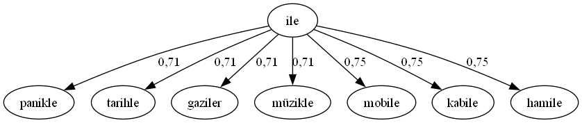

# 🌸 Java Data Similarity and Generation

Bu depo, veritabanı işlemleri ve metin benzerliği analizine yönelik **üç bağımsız Java projesinden** oluşur:  
🍃 Veri üretimi  
🍃 Sistem kayıtlarının saklanması  
🍃 Metinsel benzerlik analizi ve görselleştirme
---

## 📁 Proje Yapısı

```bash
java-data-similarity-and-generation/
├── DB_datageneration/
│   ├── basic_data.db                  # Üretilen veritabanı
│   └── src/
│       └── (default package)/
│           ├── AllColumns.java
│           ├── ColumnSimilarity.java
│           ├── InsertMillionRows.java
│           ├── Main.java
│           └── Pearson.java
│
├── registry/
│   ├── registry.db                    # Kayıt veritabanı (ignore edildi)
│   └── src/
│       └── registry/
│           └── Main.java
│
├── text/
│   ├── dictionary.db                  # Kelime veritabanı
│   ├── similarities.dot               # DOT formatında grafik çıktısı
│   ├── Similarities-graph.png         # Graphviz görselleştirme sonucu
│   ├── zemberek-ambiguous-words.txt   # Benzer kelime listesi
│   └── src/
│       └── text/
│           ├── DBWordReader.java
│           ├── main.java
│           ├── Run.java
│           ├── SimilarityCalculator.java
│           ├── SimilaritySaver.java
│           └── text_Graphviz.java
│
├── .gitignore
├── LICENSE
└── README.md

```

## 🌱 1️⃣ DB_datageneration Projesi

### 🎯 Amacı  
Gerçek veri kullanılamadığı durumlarda (gizlilik, test, analiz), yapay veri üretimi sağlar ve bu veriler üzerinden kolonlar arası benzerlik analizleri yapılmasına olanak tanır.

### ✨ Özellikler  
- 🔢 Rastgele sayısal ve metinsel veri üretimi  
- 🗃️ Üretilen verilerin `basic_data.db` adlı SQLite veritabanına kaydedilmesi  
- ⚙️ Satır ve kolon sayılarının dinamik olarak yapılandırılabilmesi  
- 📈 Pearson korelasyonu ile ikili kolonlar arasında benzerlik analizi yapılması  
- 🧮 Hesaplanan tüm benzerlik oranlarının aşağıdaki tablolara kaydedilmesi:
  - `ColumnSimilarity`: Her bir kolonun kendi geçmiş değerleriyle olan benzerliği  
  - `BinaryColumnSimilarity`: İki farklı kolon arasındaki benzerlik oranları  
  - `AverageOfAll`: Her kolonun tüm kolonlarla olan ortalama benzerlik skoru  

### 🔧 Kullanılan Teknolojiler  
- ☕ Java SE  
- 🗄️ SQLite JDBC (`org.xerial:sqlite-jdbc`)  
- 🛠️ JDK 17+  
- 🖥️ Geliştirme Ortamı: IntelliJ IDEA veya Eclipse  
- 📚 UUID ve Gaussian dağılım ile veri üretimi  


---
## 🗂️ 2️⃣ Registry Projesi

### 🎯 Amacı  
Windows kayıt defteri üzerinden sistem bilgilerini okur ve bu verileri SQLite veritabanına kaydeder. Aynı zamanda temel CRUD işlemleri için kullanılabilir.

### ✨ Özellikler  
- 🪟 Windows Registry'den veri okuma (`Advapi32Util.registryGetValues`)  
- 📥 Verilerin `registry.db` dosyasına kaydedilmesi  
- ⌨️ Konsol tabanlı çalışma (GUI içermez)  
- 🔁 Veri güncelleme, silme ve ekleme (CRUD)

### 🔧 Kullanılan Teknolojiler  
- ☕ Java SE  
- 🗄️ SQLite JDBC  
- 🔐 Windows JNA (registry erişimi için)  
- 🛠️ JDK 17+  
- 🖥️ IDE: IntelliJ IDEA, Eclipse veya NetBeans  
- 🔒 `.gitignore` ile `registry.db` gizlenmiştir (güvenlik için)

⚠️ **Not:** Kayıt defteri sistem bilgilerini içerdiğinden dolayı, kişisel veri barındırmaz ancak içerikler dikkatle kullanılmalıdır.

---
## 🧠 3️⃣ Text Projesi

### 🎯 Amacı  
SQLite veritabanında bulunan Türkçe kelimeler üzerinde metinsel benzerlik algoritmalarını kullanarak analiz yapar, en benzer kelimeleri belirler ve sonuçları grafiksel olarak sunar.

### ✨ Özellikler  
- 📚 30.000+ kelimeden oluşan sözlük verisi (`dictionary.db`)  
- 🔍 Her kelimeye benzersiz bir ID atanır  
- 🧪 En az 10 farklı metin benzerlik algoritması (Levenshtein, Jaro-Winkler vb.) ile karşılaştırma yapılır  
- 📊 Tüm algoritmaların skorları 0–1 aralığında normalize edilir  
- 🔗 Ortalamaları alınarak **kompozit benzerlik skoru** hesaplanır  
- 🔝 Her kelime için benzerliği 0.7’den yüksek olan en yakın 10 kelime belirlenir  
- 💾 Tüm benzerlik sonuçları `Similarities` tablosuna kaydedilir  
- 📈 `similarities.dot` dosyası üretilir ve Graphviz ile görselleştirilir (`Similarities-graph.png`)  

### 🖼️ Örnek Grafik  


> “ile” kelimesine benzer diğer kelimeler ve aralarındaki benzerlik oranları bir grafik ile gösterilmiştir.  

### 🔧 Kullanılan Teknolojiler  
- ☕ Java SE  
- 🗄️ SQLite JDBC  
- 🧮 Benzerlik Algoritmaları: Levenshtein, Jaro-Winkler, vs.  
- 📊 Graphviz (görselleştirme aracı)  
- 🛠️ JDK 17+  
- 🖥️ IDE: IntelliJ IDEA veya Eclipse

---
## 🧠 Kullanılan Algoritmalar

| Algoritma               | Kullanım Alanı                         |
|-------------------------|----------------------------------------|
| 🧬 Pearson Korelasyonu  | Kolonlar arası sayısal benzerlik       |
| 🔢 Levenshtein Distance | Metinler arası karakter farkı          |
| 🪞 Jaro-Winkler         | Yazım benzerliği                       |
| 🎲 Gaussian Üretim     | Normal dağılım ile rastgele veri üretimi |
| 🧮 Kompozit Skor       | Tüm algoritmaların ortalaması          |
| 🖼️ Graphviz            | Grafiksel benzerlik görselleştirme     |

---
## ⚙️ Gereksinimler

| Araç / Teknoloji        | Açıklama                            |
|-------------------------|-------------------------------------|
| ☕ Java JDK 17+          | Derleme ve çalıştırma için gerekli  |
| 🗄️ SQLite JDBC           | SQLite ile Java arasında köprü       |
| 📊 Graphviz              | .dot dosyalarının görselleştirilmesi |
| 💻 IDE                   | IntelliJ IDEA, Eclipse, NetBeans     |

---

## 🚀 Başlangıç Adımları

1. Reponun bir kopyasını klonlayın:
   ```bash
   git clone https://github.com/betulkizilkaya/java-data-similarity-and-generation.git
2. Projeyi IDE’nize aktarın
3. 📁 Her alt klasör (DB_datageneration, registry, text) bağımsız çalışabilir.
4. Gerekli bağımlılıkları ekleyin:
  •📦 JDBC sürücüsü (sqlite-jdbc)
  •📊 Graphviz (yalnızca text projesi için grafik üretimi)


📬 İletişim
📮 Her türlü öneri, geri bildirim veya katkı için GitHub Issues sekmesini kullanabilir ya da Pull Request gönderebilirsiniz.

## 📄 Lisans

MIT Lisansı © 2025 [Betül Kızılkaya](https://github.com/betulkizilkaya)  
Lisans detayları için: [LICENSE](./LICENSE)

